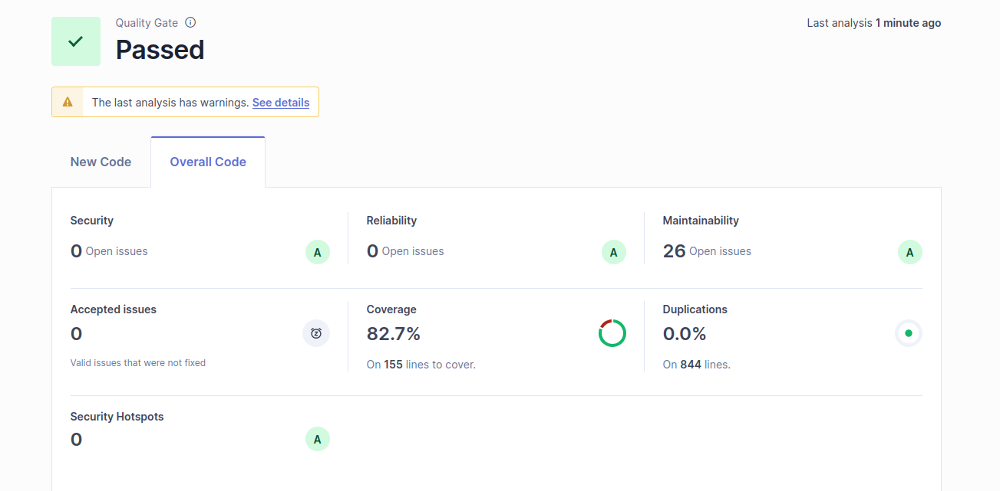

# Sistema de Cálculo de Notas Finales

Sistema backend para calcular notas finales de estudiantes considerando evaluaciones, asistencia y puntos extra.


## Resultados de calidad y análisis SonarQube

### Rquerido


### Resultado del alumno en SonarQube


## 📋 Descripción

Este proyecto implementa un sistema completo de cálculo de notas finales según los requerimientos funcionales (RF) y no funcionales (RNF) especificados. El sistema permite:

- Registrar evaluaciones con notas y pesos porcentuales
- Aplicar penalización por inasistencias
- Aplicar puntos extra por acuerdo de docentes
- Calcular la nota final de forma determinista

## 🚀 Tecnologías

- **Java 17**
- **Spring Boot 3.5.7**
- **Maven**
- **JUnit 5** (Tests)
- **JaCoCo** (Cobertura de código)
- **SonarQube** (Análisis de calidad)

## 📦 Requisitos

- Java 17 o superior
- Maven 3.6+ (incluido Maven Wrapper)
- Docker y Docker Compose (opcional, para base de datos)

## 🏗️ Estructura del Proyecto

```
.
├── backend/
│   ├── src/
│   │   ├── main/java/com/backend/backend/
│   │   │   ├── Grade/              # Módulo principal de cálculo de notas
│   │   │   │   ├── application/    # Controladores REST
│   │   │   │   ├── domain/         # Lógica de negocio
│   │   │   │   └── dto/            # Data Transfer Objects
│   │   │   └── common/             # Utilidades comunes
│   │   └── test/                   # Tests unitarios
│   ├── pom.xml
│   ├── README.md                   # Documentación del backend
│   ├── GRADE_MODULE_README.md      # Documentación del módulo Grade
│   └── VERIFICACION_RUBRICA.md     # Verificación de criterios de evaluación
├── docker-compose.yml              # Configuración de servicios (PostgreSQL)
└── README.md                       # Este archivo
```

## ⚙️ Configuración e Instalación

### Opción 1: Ejecutar con Docker Compose (Recomendado)

Para levantar la base de datos PostgreSQL:

```bash
docker-compose up -d
```

Esto iniciará:
- PostgreSQL en el puerto 5433
- Backend Spring Boot en el puerto 8080

### Opción 2: Ejecutar solo el Backend

```bash
cd backend
./mvnw spring-boot:run
```

La aplicación estará disponible en: `http://localhost:8080`

## 🧪 Ejecutar Tests

### Todos los tests

```bash
cd backend
./mvnw clean test
```

### Solo tests del módulo Grade

```bash
cd backend
./mvnw test -Dtest=Grade*Test
```

### Ver cobertura de código

```bash
cd backend
./mvnw clean test jacoco:report
```

El reporte estará disponible en: `backend/target/site/jacoco/index.html`

## 📊 Análisis de Calidad con SonarQube

```bash
cd backend
./mvnw clean test jacoco:report sonar:sonar
```

## 🔌 API Endpoints

### POST /api/grades/calculate

Calcula la nota final de un estudiante.

**Request:**
```json
{
  "examsStudents": [
    {"grade": 4.0, "weight": 50.0},
    {"grade": 3.5, "weight": 50.0}
  ],
  "hasReachedMinimumClasses": true,
  "allYearsTeachers": false
}
```

**Response:**
```json
{
  "success": true,
  "message": "Cálculo realizado exitosamente",
  "data": {
    "weightedAverage": 3.75,
    "attendancePenalty": 0.0,
    "gradeAfterAttendance": 3.75,
    "extraPoints": 0.0,
    "finalGrade": 3.75,
    "calculationTimeMs": 5,
    "message": "Promedio ponderado: 3.75. Asistencia mínima cumplida: sin penalización. Nota final: 3.75"
  }
}
```

## 📚 Documentación Adicional

- [Documentación del Backend](backend/README.md)
- [Documentación del Módulo Grade](backend/GRADE_MODULE_README.md)
- [Verificación de Rúbrica](backend/VERIFICACION_RUBRICA.md)
- [Criterios de Evaluación](backend/CRITERIOS_EVALUACION.md)

## ✅ Requerimientos Implementados

### Requerimientos Funcionales (RF)

- ✅ **RF01**: Registrar evaluaciones (nota + peso %)
- ✅ **RF02**: Registrar si cumplió asistencia mínima
- ✅ **RF03**: Registrar acuerdo de docentes para puntos extra
- ✅ **RF04**: Solicitar cálculo de nota final
- ✅ **RF05**: Visualizar detalle completo del cálculo

### Requerimientos No Funcionales (RNF)

- ✅ **RNF01**: Máximo 10 evaluaciones por estudiante
- ✅ **RNF02**: Soportar 50 usuarios concurrentes
- ✅ **RNF03**: Cálculo determinista (mismos datos = misma nota)
- ✅ **RNF04**: Tiempo de cálculo < 300 ms

## 🧩 Arquitectura

El proyecto sigue principios SOLID y arquitectura limpia:

- **Separación de responsabilidades**: Cada clase tiene una única responsabilidad
- **Bajo acoplamiento / Alta cohesión**: Componentes independientes y reutilizables
- **Clases de dominio**: `Evaluation`, `GradeCalculator`, `AttendancePolicy`, `ExtraPointsPolicy`
- **Inyección de dependencias**: Uso de Spring Framework

## 🧪 Tests

El proyecto incluye **50 tests unitarios** que cubren:

- ✅ Cálculo normal
- ✅ Sin asistencia (penalización)
- ✅ Con/Sin puntos extra
- ✅ Casos borde (0 evals, pesos inválidos, límites)
- ✅ Concurrencia (50 usuarios)
- ✅ Determinismo
- ✅ Rendimiento (< 300ms)

Todos los tests siguen el patrón de nomenclatura: `should[Acción]When[Condición]`

## 📈 Cobertura de Código

La cobertura de código supera el 50% requerido. Ver reporte en:
```
backend/target/site/jacoco/index.html
```

## 🔧 Comandos Útiles

### Compilar el proyecto

```bash
cd backend
./mvnw clean compile
```

### Ejecutar la aplicación

```bash
cd backend
./mvnw spring-boot:run
```

### Ejecutar tests específicos

```bash
cd backend
./mvnw test -Dtest=GradeCalculatorTest
```

### Limpiar y reconstruir

```bash
cd backend
./mvnw clean install
```

## 📝 Notas

- El proyecto **no incluye frontend** - solo backend API REST
- Los tests usan H2 en memoria, no requieren base de datos externa
- El proyecto está configurado para análisis con SonarQube
- Todas las constantes están definidas (sin números mágicos)
- Nombres significativos en todo el código

## 👥 Autor

Proyecto desarrollado para evaluación de Ingeniería de Software.

## 📄 Licencia

Este proyecto es parte de una evaluación académica.
